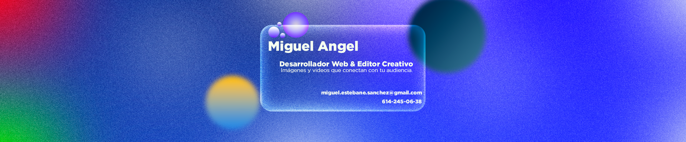

# ¡Hola, bienvenid@! 👾🌟  

## Sobre mí 👋
¡Hola! Soy un apasionado desarrollador con experiencia en una amplia gama de proyectos y tecnologías. Mi trayectoria incluye:

- 🌐 **Desarrollo Web**: Especializado en la creación de aplicaciones web progresivas (PWA), ofreciendo experiencias rápidas, modernas y confiables tanto en navegadores como en dispositivos móviles.
- 🎮 **Videojuegos**: Desarrollo de videojuegos tanto en **2D** como en **3D**, explorando tecnologías innovadoras como realidad virtual (VR) y realidad aumentada (RA) para brindar experiencias inmersivas.
- 🎥 **Diseño Multimedia**: Diseño y edición profesional de videos e imágenes, asegurando una comunicación visual efectiva y creativa en cada proyecto.

Siempre estoy buscando nuevas tecnologías y métodos para expandir mis habilidades y colaborar en proyectos desafiantes.

---

## Tecnologías que manejo 💻
Aquí tienes un vistazo a las herramientas y tecnologías con las que trabajo:

### **Frontend**

### **Backend**

### **Lenguajes**

### **Herramientas de Diseño**

